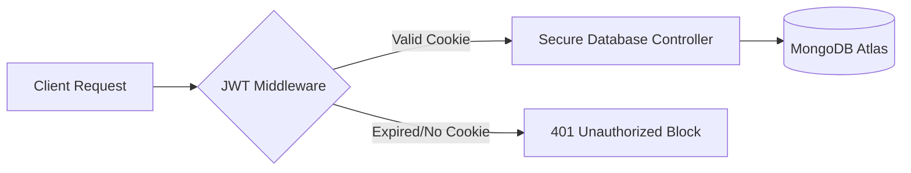

# 🐾 Prittycats — Modern Pet Adoption Hub

Prittycats is a high-performance, production-ready full-stack pet adoption ecosystem. It bridges the gap between pet lovers and shelters by providing intuitive browsing, advanced server-side filtering, dynamic user dashboards, and secure request workflows.

  
  
  
  

---

## 🔗 Quick Links

- 🌍 **Live Application:** [prittycats-client.vercel.app](https://prittycats-client.vercel.app)
- 💻 **Client Repository:** [github.com/mdshantosharker/prittycats-client](https://github.com/mdshantosharker/prittycats-client)
- 🧠 **Server Repository:** [github.com/mdshantosharker/prittycats-server](https://github.com/mdshantosharker/prittycats-server)

---

## 🔥 Core Capabilities

### 🔀 Multi-Role Architecture

- **For Adopters:** Search, filter species via MongoDB `$in`/`$regex`, submit requests, track timelines, and manage lifecycle cancellations.
- **For Owners/Shelters:** Dynamic stats panels, listing management (CRUD), and an optimized single-approval modal workflow.

### 🔐 Ironclad Security & Pipeline

- **JWT State Guard:** Stateless authorization leveraging `HTTPOnly` cookies, preventing cross-site scripting (XSS).
- **Zero Restarts:** Private routes and data contexts persist cleanly during hard page reloads.

### 🐾 Smart Business Engine

- Dynamic blocks preventing owners from requesting or modifying their own listings.
- Instant adoption locks: Once a pet request status flips to `Approved`, alternative applications freeze instantly.

---

## 🛠️ Tech Stack & Micro-Dependencies

| Layer        | Technology             | Key Libraries                                         |
| :----------- | :--------------------- | :---------------------------------------------------- |
| **Frontend** | Next.js / Tailwind CSS | framer-motion,lottie-react, swiper, React Toastify    |
| **Backend**  | Node.js / Express.js   | Mongoose, JSONWebToken, Cookie-Parser, CORS |
| **Database** | MongoDB Atlas          | Native Indexed Arrays, Dynamic Aggregations           |

---

## ⚙️ System Behavior & Core Logic

### 🛡️ Request Lifecycle & Security Guards

- **JWT Middleware Pipeline:** Every protected API endpoint route intercepts incoming traffic to validate authorization states before hitting controllers.
- **HTTPOnly Cookie Storage:** Secure session tokens are read directly from `HTTPOnly` browser cookies, establishing robust mitigation against XSS and token-theft vulnerabilities.
- **Fail-Fast Auth Block:** Invalid, tampered, or expired tokens trigger an immediate backend `401 Unauthorized` response, blocking data exposure.
- **Controller-Level Ownership Verification:** Cross-referencing logic ensures users cannot modify, delete, or process adoption approvals for listings they do not own.

### 🧪 Advanced Data Handling & DB Optimization

- **Case-Insensitive `$regex` Queries:** Text search on the _All Pets_ page uses native MongoDB regular expressions to deliver flexible, real-time query matching.
- **Multi-Species `$in` Arrays:** Filter pipelines process multiple user selections concurrently by executing non-blocking array subset checks.
- **Atomic Transaction Updates:** Status modifications utilize atomic database mutations to block race conditions, making sure a pet cannot be accidentally approved for multiple adopters.
- **Optimistic UI Engine:** Dashboards and listing states utilize fast state-hydration to reflect data updates instantly across views without requiring hard page reloads.
- **MongoDB Aggregation Pipelines:** Complex stats (Total Listings, Available counts, Adopted logs) are calculated directly inside the database layer for maximum scalability.

---

## 🚀 Production-Grade Architecture Note

**Prittycats** is engineered from the ground up to reflect industry-standard full-stack workflows rather than a basic assignment template. The architecture highlights:

1. **Decoupled Clean Codebase:** Absolute separation of concerns between the Next.js presentation layers and the Express/Node service controllers.
2. **Ironclad Stateful Workflows:** Real-world business limitations mapping out complete pet lifecycles, user authentication states, and dashboard syncs.
3. **Recruiter-Ready Presentation:** Optimized for rapid auditing with precise loading states, interactive clean modals, custom error pages, and an accessible responsive design.

## 📡 Backend Architecture Flow

